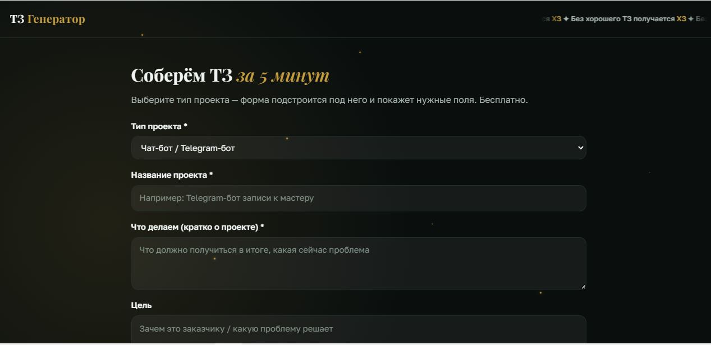
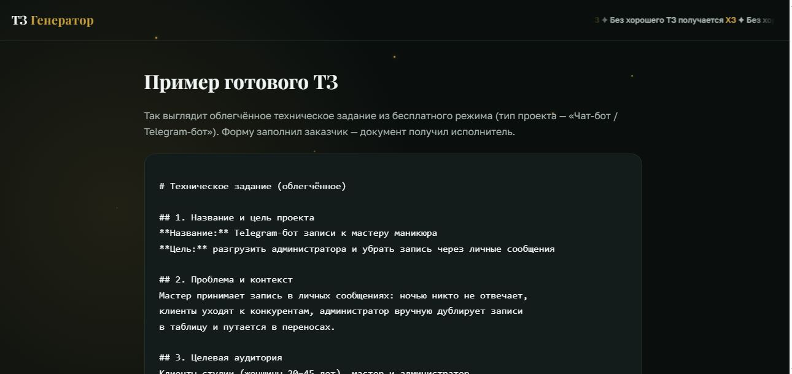

# TZ Generator — генератор технических заданий

Веб-сервис, который превращает ответы на несколько вопросов в готовое техническое задание.

**Без хорошего ТЗ получается ХЗ** — поэтому фрилансеры и малые команды тратят часы на переписку с заказчиком: объём работ размыт, правки бесконечны, спорить не о чем. TZ Generator структурирует задачу за 5 минут и выдаёт документ, который можно приложить к договору.


## Что умеет

- **Облегчённое ТЗ — бесплатно.** Скелет ТЗ (цель, проблема, ЦА, требования по MoSCoW, сроки, критерии приёмки) + типовые блоки под тип проекта: бот, ИИ-ассистент, автоматизация, скрипт, сайт, дизайн.
- **ТЗ по ГОСТ (19/34) — 100 ₽.** Полная структура: стадии работ, требования к системе, порядок приёмки. Оплата через ЮMoney, в том числе по QR-коду с телефона.
- **ИИ-полировка текста.** Черновик пользователя вычитывает языковая модель (ЯндексGPT): исправляет опечатки и корявые формулировки, не меняя сути. Если API недоступен — сервис работает без полировки, генерация не ломается.
- **Экспорт** в Markdown и .docx — можно сразу отправить заказчику.
- **Telegram-уведомления** исполнителю: оплата и каждое скачивание ТЗ.

## Скриншоты





## Стек

- Python 3.11 + Flask
- SQLite не используется — хранение в памяти процесса (MVP); журнал платежей — файл
- ЯндексGPT Lite (OpenAI-совместимый API) для полировки текста
- ЮMoney quickpay для приёма платежей
- python-docx для экспорта

Никаких тяжёлых моделей и эмбеддингов — сервис работает на самом дешёвом VPS.

## Запуск локально

```bash
git clone <repo>
cd tz-generator
python -m venv venv
venv\Scripts\pip install -r requirements.txt   # Windows
copy .env.example .env                          # и заполнить переменные
venv\Scripts\python.exe app.py
```

Открыть http://localhost:5000

## Переменные окружения (.env)

| Переменная | Назначение |
|---|---|
| `YOOMONEY_RECEIVER` | Номер кошелька ЮMoney для приёма оплаты |
| `APP_URL` | Публичный адрес (для successURL оплаты, sitemap) |
| `LLM_BASE_URL` / `LLM_API_KEY` / `LLM_MODEL` / `LLM_FOLDER_ID` | Доступ к LLM-полировке. Пусто = работает без ИИ |
| `TG_BOT_TOKEN` / `TG_ADMIN_CHAT_ID` | Telegram-уведомления. Пусто = без уведомлений |

Секреты только в `.env` — в репозиторий не попадают.

## Монетизация

Облегчённый режим бесплатный (привлечение), ТЗ по ГОСТ — 100 ₽ (доход).
Плановая автоматизация: серверное подтверждение платежа через HTTP-уведомления ЮMoney.

## Структура

```
tz-generator/
├── app.py            # Flask: генерация, экспорт, SEO
├── payments.py       # приём оплаты и TG-уведомления (приватный модуль, не публикуется)
├── Dockerfile        # контейнер для деплоя
├── templates/        # index, form, result, gost_pay, example
├── static/style.css  # стили (тёмная тема, без фреймворков)
├── payments.log      # журнал платежей (создаётся в рантайме)
└── .env.example      # шаблон переменных окружения
```

## Автор

Диана Кокорева — [medvejka.ru](https://medvejka.ru). Автоматизации, боты, ИИ-ассистенты.